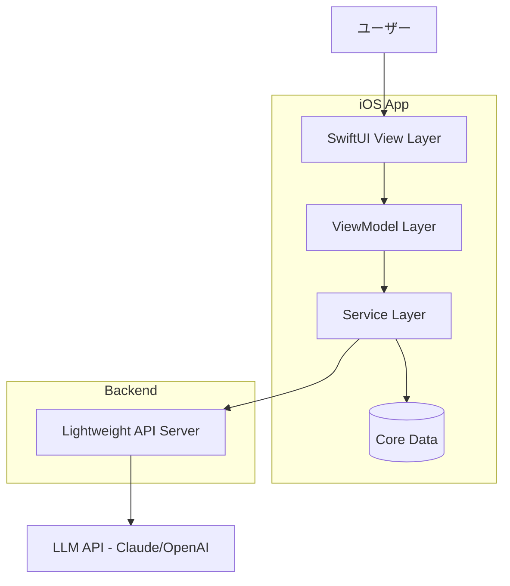
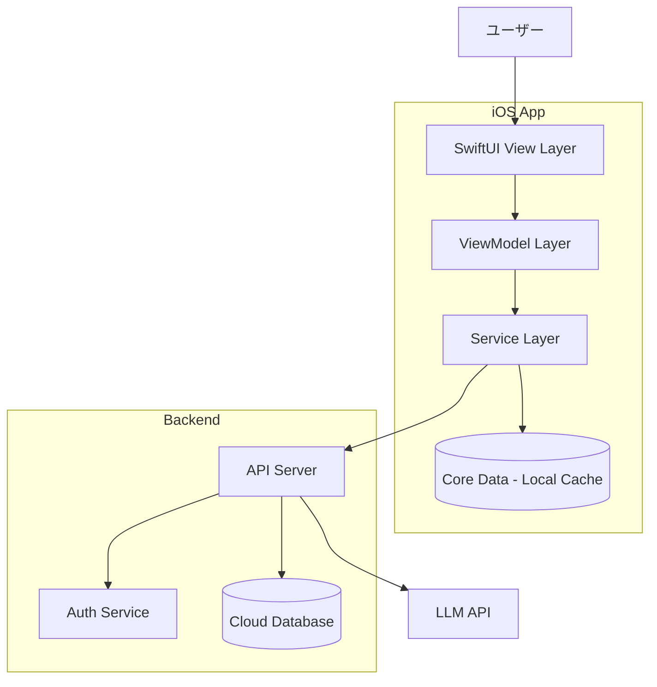
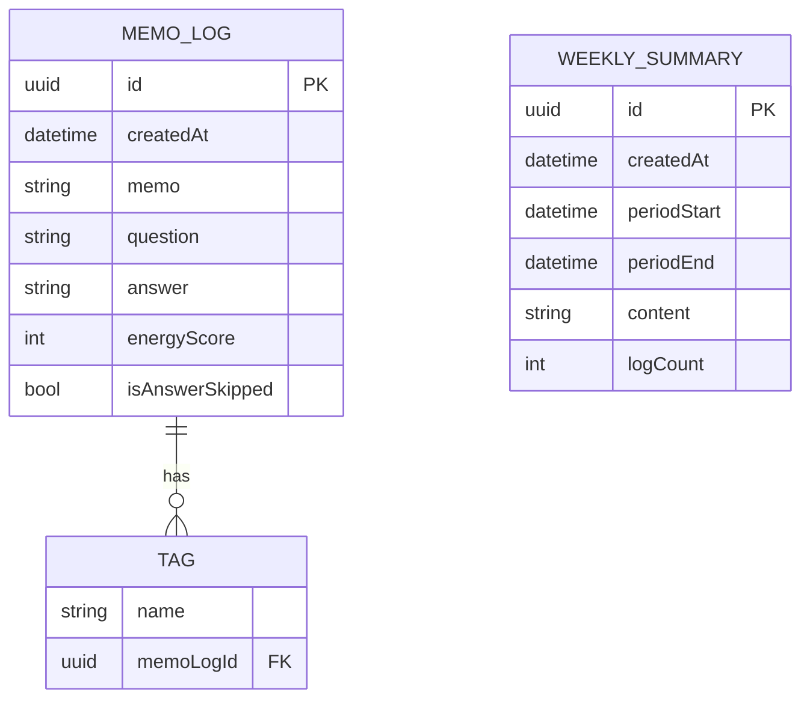
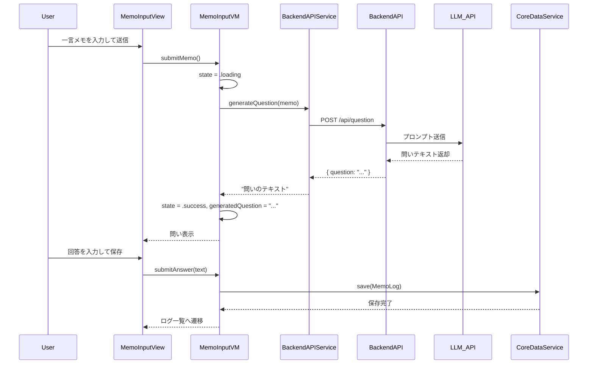
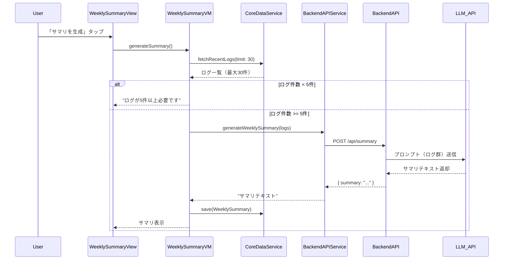
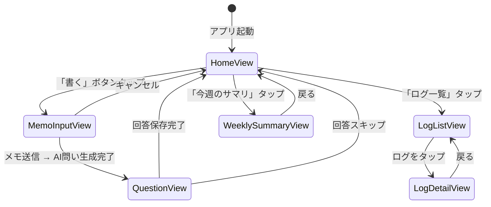

# 機能設計書 (Functional Design Document)

## システム構成図

### Phase 0（プロトタイプ）: ローカル中心構成



### Phase 2（クラウド対応）: バックエンド拡張構成



---

## 技術スタック

| 分類 | 技術 | 選定理由 |
|------|------|----------|
| iOS UI | SwiftUI | 宣言的UIでアニメーション表現が豊か、モダンなiOS開発標準 |
| iOS アーキテクチャ | MVVM + Combine | 状態管理の明確化、非同期処理の扱いやすさ |
| ローカルDB | Core Data | iOSネイティブ、自動バックアップ対応、オフライン保証 |
| バックエンド | Node.js (Express) | 軽量・高速、LLM API連携の実績が豊富 |
| LLM API | Claude API (Anthropic) | 高品質な問い生成、日本語対応が優秀 |
| 通信 | URLSession + async/await | iOSネイティブ、型安全なAPI通信 |
| 認証（Phase 2） | Firebase Auth / Sign in with Apple | iOSとの親和性が高い |
| クラウドDB（Phase 2） | Firebase Firestore | リアルタイム同期、スケーラビリティ |

---

## データモデル定義

### エンティティ: MemoLog（感性ログ）

```swift
struct MemoLog: Identifiable, Codable {
    let id: UUID                    // 一意識別子
    let createdAt: Date             // 作成日時
    var memo: String                // ユーザーの一言メモ（1文字以上）
    var question: String            // AIが生成した問い
    var answer: String?             // ユーザーの回答（スキップ可）
    var tags: [String]              // 任意タグ（Phase 1で追加）
    var energyScore: Int?           // 熱量スコア 1〜5（Phase 1で追加）
    var isAnswerSkipped: Bool       // 回答をスキップしたかどうか
}
```

**制約**:
- `memo`: 1文字以上、上限なし（UIは短文推奨）
- `question`: LLM APIから返却される（空にならない）
- `answer`: nilはスキップ状態、空文字と区別する
- `tags`: 0〜N個（Phase 1 以降）
- `energyScore`: 1〜5の整数、nilは未設定（Phase 1 以降）

---

### エンティティ: WeeklySummary（週次サマリ）

```swift
struct WeeklySummary: Identifiable, Codable {
    let id: UUID                    // 一意識別子
    let createdAt: Date             // 生成日時
    let periodStart: Date           // 集計期間の開始日
    let periodEnd: Date             // 集計期間の終了日
    var content: String             // AIが生成したサマリ本文
    var logCount: Int               // 集計対象のログ件数
}
```

**制約**:
- `content`: LLM APIから返却される（空にならない）
- `logCount`: 5件以上のログが対象（5件未満では生成しない）

---

### ER図



---

## コンポーネント設計

### iOS: View Layer (SwiftUI)

**責務**:
- ユーザーとのインタラクション
- ViewModelのステートをバインドして表示
- アニメーション・トランジション

**主要View**:
```
HomeView            -- ホーム（最新ログ・入力ボタン）
MemoInputView       -- 一言メモ入力
QuestionView        -- AI問い表示 + 回答入力
LogListView         -- ログ一覧
LogDetailView       -- ログ詳細
WeeklySummaryView   -- 週次サマリ表示
```

---

### iOS: ViewModel Layer

**責務**:
- ビジネスロジックの制御
- Service Layerへの委譲
- UI状態（loading, error, data）の管理

```swift
class MemoInputViewModel: ObservableObject {
    @Published var memoText: String = ""
    @Published var generatedQuestion: String?
    @Published var state: ViewState = .idle   // idle | loading | success | error

    func submitMemo() async          // メモ送信 → AI問い生成を開始
    func submitAnswer(_ text: String) async  // 回答を保存
    func skipAnswer() async          // 回答をスキップして保存
}

class LogListViewModel: ObservableObject {
    @Published var logs: [MemoLog] = []
    @Published var selectedTag: String?

    func loadLogs()                  // ログ一覧を取得
    func filterByTag(_ tag: String)  // タグで絞り込み
    func deleteLog(_ id: UUID)       // ログを削除
}

class WeeklySummaryViewModel: ObservableObject {
    @Published var summary: WeeklySummary?
    @Published var state: ViewState = .idle

    func generateSummary() async     // サマリ生成をリクエスト
    func loadLatestSummary()         // 最新サマリを取得
}
```

---

### iOS: Service Layer

**責務**:
- ローカルDBとの通信（CoreDataService）
- バックエンドAPIとの通信（APIService）

```swift
protocol MemoLogRepository {
    func save(_ log: MemoLog) throws
    func fetchAll() throws -> [MemoLog]
    func fetchRecentLogs(limit: Int) throws -> [MemoLog]  // UC-02 サマリ生成で使用
    func fetchByTag(_ tag: String) throws -> [MemoLog]
    func delete(id: UUID) throws
}

protocol AIService {
    func generateQuestion(from memo: String) async throws -> String
    func generateWeeklySummary(from logs: [MemoLog]) async throws -> String
}
```

**CoreDataService**: `MemoLogRepository` の Core Data 実装

**BackendAPIService**: `AIService` の実装（バックエンド経由でLLM APIを呼び出す）

---

### バックエンド: API Server

**責務**:
- APIキーの安全な保管と利用
- LLM APIへのリクエスト仲介
- プロンプトの構築

```
POST /api/question    -- メモからAI問いを生成
POST /api/summary     -- ログ群からサマリを生成
GET  /health          -- ヘルスチェック
```

---

## ユースケース図

### UC-01: メモ入力 → AI問い生成 → 回答保存



---

### UC-02: 週次サマリ生成



---

## 画面遷移図



---

## API設計（バックエンド）

### 認証方式

Phase 0〜1では固定シークレットトークンによる認証を使用する。全エンドポイントに `Authorization` ヘッダーが必須。

```
Authorization: Bearer {APP_SECRET_TOKEN}
```

- `APP_SECRET_TOKEN` はバックエンドの環境変数（`.env`）で管理する
- iOSアプリは `Info.plist` またはビルド設定から読み込み、コードに直書きしない
- Phase 2（Firebase Auth導入後）はJWTトークンに移行する

**認証失敗時のレスポンス**:
- `401 Unauthorized`: トークン未設定または不一致

---

### POST /api/question

メモテキストからAIの問いを生成する。

**リクエストヘッダー**:
```
Authorization: Bearer {APP_SECRET_TOKEN}
Content-Type: application/json
```

**リクエストボディ**:
```json
{
  "memo": "結婚式で友達の熱量に嫉妬した"
}
```

**レスポンス（200 OK）**:
```json
{
  "question": "あなたが羨ましかったのは、彼らの才能ですか？ それとも、自分たちの人生を自分たちの色で表現している感じですか？"
}
```

**エラーレスポンス**:
- `400 Bad Request`: memoが空または未指定
- `401 Unauthorized`: 認証トークン不一致
- `500 Internal Server Error`: LLM API呼び出し失敗

---

### POST /api/summary

ログ群からAIの週次サマリを生成する。送信するログは直近30件以内に限定する。

**リクエストヘッダー**:
```
Authorization: Bearer {APP_SECRET_TOKEN}
Content-Type: application/json
```

**リクエストボディ**:
```json
{
  "logs": [
    {
      "memo": "宇宙のことを考えるとワクワクする",
      "question": "...",
      "answer": "...",
      "createdAt": "2026-05-20T22:00:00Z"
    }
  ]
}
```

**レスポンス（200 OK）**:
```json
{
  "summary": "今週のログを振り返ると、「宇宙」「未来」「知的挑戦」に対して強い反応が見られます。..."
}
```

**エラーレスポンス**:
- `400 Bad Request`: logsが空または5件未満
- `401 Unauthorized`: 認証トークン不一致
- `500 Internal Server Error`: LLM API呼び出し失敗

---

## AIプロンプト設計

### 問い生成プロンプト

**システムプロンプト**:
```
あなたは「感性の観測者」です。
ユーザーが日常のふとした気づきや感情を一言メモとして送ってきます。
そのメモに対して、思考が少し斜め上に飛ぶような問いを1つだけ返してください。

問いの方向性：
- 妄想や想像を広げる
- 感情の奥にある価値観を掘り下げる
- SF・科学・未来・人生観に接続する
- 「自分の人生」「自分の色」「創造性」に気づかせる

禁止事項：
- 正論・アドバイス・慰めを言わない
- カウンセリング風にしない（「その感情は自然なことです」など）
- 複数の問いを返さない（必ず1つだけ）
- 問いの後に解説を加えない

出力形式：
問いの文章のみ。余計な説明不要。
```

**ユーザーメッセージ**:
```
{memo}
```

**出力例**:
```
入力: 「結婚式で友達の熱量に嫉妬した」
出力: 「あなたが羨ましかったのは、彼らの才能ですか？ それとも、自分たちの人生を自分たちの色で表現している感じですか？」

入力: 「宇宙のことを考えるとワクワクする」
出力: 「もしあなたが一つだけ人類の未来に貢献できるとしたら、それは"知ること"と"作ること"のどちらに近いですか？」
```

---

### 週次サマリプロンプト

**システムプロンプト**:
```
あなたは「感性の観測者」です。
ユーザーのここ数週間の感性ログ（メモ・問い・回答のセット）を読み、
その人の感性パターン・価値観・熱量の傾向をまとめてください。

まとめ方のルール：
- 「あなたはこうです」と断定しない（「〜の傾向が見えます」「〜に反応しやすそうです」という表現）
- 心理診断のような分析をしない
- 200〜400文字程度でコンパクトにまとめる
- 具体的なメモやキーワードを引用して根拠を示す
- ポジティブな発見として表現する

出力形式：
サマリのテキストのみ。
```

**ユーザーメッセージ**:
```
以下は私の最近の感性ログです：

{logs_formatted}
```

---

## UI設計

### デザインコンセプト
- 世界観: 「静かな宇宙船のログ」「感性の観測所」
- カラーパレット: ダーク基調（ディープネイビー/ブラック + アクセントカラー）
- フォント: システムフォント（San Francisco）、余白を多く取る
- アニメーション: 問い生成時に静かなフェードイン

### ホーム画面 (HomeView)

```
┌────────────────────────────┐
│                            │
│    Inner Orbit             │ ← タイトル
│    2026年5月25日            │ ← 今日の日付
│                            │
│  ┌──────────────────────┐  │
│  │  今日ふと思ったことは？ │  │ ← 入力促進テキスト
│  │  [ 書く ]            │  │ ← メインCTA
│  └──────────────────────┘  │
│                            │
│  最近のログ                 │
│  ─────────────────────     │
│  05/24  「宇宙のことを考える│ ← ログ一覧の最新3件
│  05/22  「仕事で意味を感じ...│
│  05/20  「子どもと遊んで...  │
│                            │
│  [ ログ一覧 ]  [ 今週のサマリ ]│
└────────────────────────────┘
```

### メモ入力画面 (MemoInputView)

```
┌────────────────────────────┐
│  ← 戻る                    │
│                            │
│  ふと思ったことを            │
│  書いてみてください          │
│                            │
│  ┌──────────────────────┐  │
│  │                      │  │ ← テキスト入力（即フォーカス）
│  │                      │  │
│  └──────────────────────┘  │
│                            │
│          [ 送る ]           │
└────────────────────────────┘
```

### AI問い + 回答画面 (QuestionView)

```
┌────────────────────────────┐
│                            │
│  あなたのメモ:              │
│  「宇宙のことを考えると...」 │
│                            │
│  ───────────────────────── │
│                            │
│  ✦ もしあなたが一つだけ     │ ← AI問い（フェードイン）
│  人類の未来に貢献できると   │
│  したら、それは"知ること"と  │
│  "作ること"のどちらに       │
│  近いですか？               │
│                            │
│  ───────────────────────── │
│                            │
│  ┌──────────────────────┐  │
│  │ あなたの答えは？       │  │ ← 回答入力
│  └──────────────────────┘  │
│                            │
│  [ 保存する ]  [ スキップ ] │
└────────────────────────────┘
```

---

## エラーハンドリング

### エラーの分類

| エラー種別 | 処理 | ユーザーへの表示 |
|-----------|------|-----------------|
| メモが空 | 送信ボタンを無効化 | （ボタンが押せない状態） |
| API通信エラー | ローディング解除、リトライ提示 | 「問いの生成に失敗しました。もう一度試してください」 |
| LLM API タイムアウト（10秒超） | エラー表示 | 「少し時間がかかっています。もう一度試してください」 |
| Core Data 保存エラー | エラーログ記録、ユーザー通知 | 「保存に失敗しました。ストレージを確認してください」 |
| ログ件数不足（サマリ生成時） | サマリ生成をブロック | 「サマリはログが5件以上になると生成できます（現在N件）」 |
| ネットワーク未接続 | オフライン検出 | 「インターネット接続が必要です」 |

---

## パフォーマンス最適化

- **AI問い生成のローディング表現**: ローディング中は「あなたのメモを読んでいます...」→「問いを考えています...」とメッセージを切り替え、体験上の待ち時間感を軽減する
- **Core Data フェッチ最適化**: ログ一覧はNSFetchRequestに `fetchLimit` と `sortDescriptors` を設定し、100件を上限とする
- **API通信の非同期処理**: `async/await` + `Task` で非同期制御し、UIスレッドをブロックしない
- **週次サマリのキャッシュ**: 生成済みサマリはCore Dataに保存し、同週の再生成はキャッシュから返す

---

## セキュリティ考慮事項

- **APIキーの保護**: LLM APIキーはバックエンドサーバーにのみ保管。iOSアプリにはAPIキーを含めない
- **通信の暗号化**: バックエンドAPIとの通信はHTTPS必須（ATS: App Transport Security）
- **ローカルデータの保護**: Core DataのストアはData Protection（NSFileProtectionComplete）を適用
- **プライバシー表示**: 初回起動時に「AI処理のためにメモ内容をサーバーに送信します」と明示し、同意を得る
- **Phase 2の認証**: Firebase Auth / Sign in with Appleを使用し、ユーザーIDと紐づけてデータアクセス制御を実施

---

## テスト戦略

### ユニットテスト
- ViewModel のビジネスロジック（状態遷移、バリデーション）
- CoreDataService の保存・取得・削除
- BackendAPIService のリクエスト/レスポンス変換

### 統合テスト
- メモ入力 → AI問い生成 → 回答保存の一連フロー
- 週次サマリ生成フロー（ログ5件未満 / 5件以上）
- エラー発生時のリカバリフロー

### UI / E2Eテスト
- XCUITest による主要フローの自動テスト
  - 初回起動 → メモ入力 → 回答保存 → ログ一覧確認
  - ログ5件蓄積後 → 週次サマリ生成 → 閲覧
