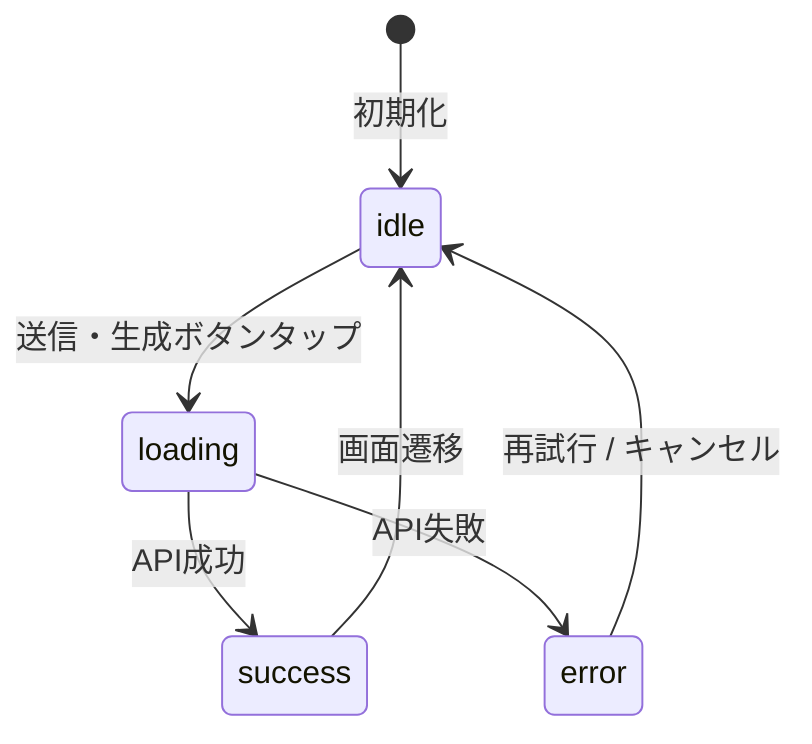

# プロジェクト用語集 (Glossary)

## 概要

このドキュメントは、Inner Orbit プロジェクトで使用される用語の定義を管理します。
新しい用語が登場した際はここに追加してください。

**更新日**: 2026-05-25

---

## ドメイン用語

### 感性ログ

**定義**: ユーザーの一言メモ・AIの問い・ユーザーの回答の3点セットを1件とする記録単位。

**説明**:
日常の気づきや感情を起点に、AIとの問答を通じて自分の感性・価値観を掘り起こすための基本データ単位。複数の感性ログが積み重なることで「感性の地図」が形成される。

**関連用語**: [一言メモ](#一言メモ)、[AI問い](#ai問い)、[週次サマリ](#週次サマリ)

**使用例**:
- 「今日、感性ログを1件記録した」
- 「感性ログが5件以上溜まると週次サマリが生成できる」

**英語表記**: MemoLog

**データモデル**: `iOS/InnerOrbit/Models/MemoLog.swift`

---

### 一言メモ

**定義**: ユーザーがアプリに入力する、日常のふとした気づき・感情・違和感を記した短いテキスト。感性ログ記録の起点となる。

**説明**:
「一言」と名付けているが文字数制限はない。重要なのは量ではなく、「ふと思ったこと」を低いハードルで記録することにある。

**関連用語**: [感性ログ](#感性ログ)、[AI問い](#ai問い)

**使用例**:
- 「結婚式で友達の熱量に嫉妬した」
- 「宇宙のことを考えるとワクワクする」
- 「今日の仕事は意味を感じなかった」

**英語表記**: Memo

---

### AI問い

**定義**: ユーザーの一言メモをもとにAIが生成する、思考を斜め上に飛ばすような問いかけ。

**説明**:
正論・慰め・カウンセリング的な共感を避け、「妄想を広げる」「感情の奥を掘る」「価値観を見つける」「SF・未来に接続する」方向性の問いを1つだけ返す。複数の問いを返さないことが重要。

**関連用語**: [一言メモ](#一言メモ)、[問い生成](#問い生成)

**使用例**:
- 入力「宇宙のことを考えるとワクワクする」
- AI問い「もしあなたが一つだけ人類の未来に貢献できるとしたら、それは"知ること"と"作ること"のどちらに近いですか？」

**英語表記**: Question

---

### 週次サマリ

**定義**: 蓄積された感性ログをもとにAIが生成する、ユーザーの感性パターン・価値観・熱量の傾向をまとめたテキスト。

**説明**:
心理診断のように断定せず、「〜の傾向が見えます」「〜に反応しやすそうです」という表現を使う。ログが5件以上蓄積された場合に生成可能。週1回または手動でも生成できる。

**関連用語**: [感性ログ](#感性ログ)、[サマリ生成](#サマリ生成)

**使用例**:
- 「今週のサマリ：あなたは「未来」「知的挑戦」「仲間の熱量」に強く反応する傾向が見えます」

**英語表記**: WeeklySummary

**データモデル**: `iOS/InnerOrbit/Models/WeeklySummary.swift`

---

### 熱量スコア

**定義**: ユーザーが感性ログを記録した際に任意で設定する1〜5段階の感情強度。

**説明**:
Phase 1で追加される機能。スコアは任意であり、設定しなくても保存できる。週次サマリの分析にも活用される。

**値の定義**:

| スコア | 意味 |
|------|------|
| 1 | ほぼ感情の動きがない |
| 2 | 少し反応した |
| 3 | 普通に反応した |
| 4 | かなり反応した |
| 5 | 強烈に反応した（嫉妬・歓喜・違和感など） |

**関連用語**: [感性ログ](#感性ログ)

**英語表記**: EnergyScore

---

### 感性

**定義**: 本プロジェクトにおいて「感性」とは、何かを見たり体験したりした時に心が動く反応の総体。美的感覚・価値観・熱量・創造性を含む広い概念。

**説明**:
「感性が鈍る」とは、日常のタスクに追われる中で自分が何に心動くのかが分からなくなっている状態を指す。Inner Orbitはこの感性を「掘り起こす」ことを目的とする。

**関連用語**: [感性ログ](#感性ログ)、[AI問い](#ai問い)

**英語表記**: Sensibility

---

### 感性の地図

**定義**: 複数の感性ログが蓄積されることで形成される、ユーザー自身の感性・価値観・熱量パターンの全体像。

**説明**:
週次サマリはこの地図の一断面を言語化したもの。ログが積み重なるほど輪郭が鮮明になる。Inner Orbit のプロダクトビジョンの中心的なメタファー。

**関連用語**: [感性ログ](#感性ログ)、[週次サマリ](#週次サマリ)

**英語表記**: Sensibility Map

---

### 感性の観測者

**定義**: Inner Orbit のAIに与えたペルソナ名。問い生成・サマリ生成のシステムプロンプトで「あなたは感性の観測者です」として定義される。

**説明**:
正論・アドバイス・カウンセリング的な共感を避け、ユーザーの感性を静かに観察し、思考を斜め上に飛ばす問いを返す役割。AIの人格設計の根拠となる概念。

**関連用語**: [AI問い](#ai問い)、[問い生成](#問い生成)

**参照**: [機能設計書 - AIプロンプト設計](./functional-design.md#aiプロンプト設計)

---

### タグ

**定義**: ユーザーが感性ログに任意で付与できる分類ラベル。

**説明**:
Phase 1で追加される機能。自由入力でプリセットはなく、過去に使ったタグはサジェストされる（同じタグを3回以上使用で候補表示）。ログ一覧でタグによる絞り込みが可能。

**関連用語**: [感性ログ](#感性ログ)

**データモデル**: `MemoLog.tags: [String]`（Phase 1追加）

---

### Phase（開発フェーズ）

**定義**: Inner Orbit の開発・検証を段階的に進めるためのフェーズ区分。

**フェーズ定義**:

| Phase | 名称 | 目的 | 主な機能 |
|-------|------|------|---------|
| Phase 0 | プロトタイプ | 自分が使って刺さる体験か確認する | メモ入力・AI問い生成・回答保存・ローカル保存 |
| Phase 1 | MVP | 1週間使える状態にする | 週次サマリ・タグ・熱量スコア |
| Phase 2 | 小規模配布 | 他人にも刺さるか確認する | アカウント認証・クラウド保存・TestFlight配布 |

**関連ドキュメント**: [PRD - 開発フェーズ計画](./product-requirements.md#開発フェーズ計画)

---

### 問い生成

**定義**: ユーザーの一言メモをバックエンド経由でLLM APIに送信し、AI問いを返す処理。

**説明**:
iOSアプリ → バックエンドAPI → LLM API の順に処理される。APIキーをiOSアプリに含めないためにバックエンドを経由する。生成には通常数秒かかるため、ローディング演出を表示する。

**関連用語**: [AI問い](#ai問い)、[LLM](#llm)

**API**: `POST /api/question`

---

### サマリ生成

**定義**: 蓄積された感性ログをバックエンド経由でLLM APIに送信し、週次サマリを生成する処理。

**説明**:
ログが5件未満の場合は生成できない。直近30件のログのみを送信し、APIコストを抑制する。生成には問い生成より時間がかかる（最大15秒程度）。

**関連用語**: [週次サマリ](#週次サマリ)、[LLM](#llm)

**API**: `POST /api/summary`

---

## 技術用語

### SwiftUI

**定義**: Apple が提供する宣言的UIフレームワーク。iOS/macOS/watchOS/tvOS のUIを Swift コードで構築する。

**本プロジェクトでの用途**: Inner Orbit iOSアプリの全画面をSwiftUIで実装する。

**バージョン**: iOS 17.0以上で使用

**選定理由**: 宣言的UIでアニメーション表現が豊か、モダンなiOS開発の標準、状態管理（`@Published`/`@State`）と相性が良い

**関連ドキュメント**: [アーキテクチャ設計書](./architecture.md#テクノロジースタック)

---

### Core Data

**定義**: Apple が提供する iOSネイティブのオブジェクトグラフ管理・永続化フレームワーク。

**本プロジェクトでの用途**:
Phase 0〜1において感性ログ・週次サマリをデバイスローカルに保存する。

**バージョン**: iOS 17.0以上の標準ライブラリ

**選定理由**: iOSネイティブのため追加依存なし、自動バックアップ対応、`NSFileProtectionComplete` による暗号化が容易

**関連ドキュメント**: [機能設計書](./functional-design.md#データ永続化戦略)

---

### Combine

**定義**: Apple が提供する宣言的な非同期処理・イベント処理フレームワーク。Publisher/Subscriber パターンで実装される。

**本プロジェクトでの用途**:
ViewModel の `@Published` プロパティを通じてView層とのデータバインディングを実現する。

**バージョン**: iOS 17.0以上の標準ライブラリ

**関連ドキュメント**: [アーキテクチャ設計書](./architecture.md)

---

### Claude API

**定義**: Anthropic が提供する大規模言語モデル（Claude）のAPI。

**本プロジェクトでの用途**:
バックエンドサーバーからAI問い生成・サマリ生成のためにAPIを呼び出す。iOSアプリからは直接呼び出さず、バックエンド経由でのみ使用する。

**SDK**: `@anthropic-ai/sdk`（Node.js）

**選定理由**: 日本語対応が優秀、高品質な問い生成、プロンプトキャッシュ等の高度機能が利用可能

**関連ドキュメント**: [機能設計書](./functional-design.md#aiプロンプト設計)

---

### Express

**定義**: Node.js向けの軽量Webアプリケーションフレームワーク。

**本プロジェクトでの用途**:
バックエンドAPIサーバーのフレームワークとして使用。`/api/question` と `/api/summary` エンドポイントを提供する。

**バージョン**: 4.x

**選定理由**: 軽量・シンプル、MVPに適した最小構成

---

## アーキテクチャ用語

### MVVM

**定義**: Model-View-ViewModel の略。UIレイヤーの設計パターン。

**本プロジェクトでの適用**:

```
View（SwiftUI）
    ↓ バインディング（@Published）
ViewModel（ObservableObject）
    ↓ メソッド呼び出し
Service/Repository（Protocol）
```

- **View**: SwiftUIで宣言的に画面を記述、ViewModelの`@Published`プロパティをバインド
- **ViewModel**: UI状態（`ViewState`）を管理、ユーザーアクションをServiceに委譲
- **Model**: Swift構造体（`MemoLog`、`WeeklySummary`）でドメインデータを表現

**メリット**: テスト可能性の向上、関心の分離、Swiftとの親和性

**関連コンポーネント**: `iOS/InnerOrbit/ViewModels/`

---

### Repository パターン

**定義**: データソース（CoreData、APIなど）へのアクセスをProtocolで抽象化し、ビジネスロジックからデータ永続化の詳細を隠蔽する設計パターン。

**本プロジェクトでの適用**:

```swift
// Protocol定義（ServiceはProtocolにのみ依存）
protocol MemoLogRepositoryProtocol {
    func save(_ log: MemoLog) throws
    func fetchAll() throws -> [MemoLog]
}

// Phase 0: CoreDataによる実装
class CoreDataMemoLogRepository: MemoLogRepositoryProtocol { ... }

// Phase 2: Firestoreによる実装（差し替え可能）
class FirestoreMemoLogRepository: MemoLogRepositoryProtocol { ... }
```

**メリット**: 実装を差し替えてもServiceのコードは変更不要（Phase 2のクラウド移行時に有効）

**関連コンポーネント**: `iOS/InnerOrbit/Services/Protocols/`、`iOS/InnerOrbit/Repositories/`

---

### 依存性注入（DI）

**定義**: クラスが依存するオブジェクトを外部から注入する設計手法。本プロジェクトでは Protocolを使ったコンストラクタインジェクションを採用する。

**本プロジェクトでの適用**:

```swift
// ✅ Protocolを通じて注入（テスト時はモックを注入可能）
class MemoInputViewModel: ObservableObject {
    private let aiService: AIServiceProtocol
    init(aiService: AIServiceProtocol) {
        self.aiService = aiService
    }
}

// 本番: 実装クラスを注入
let vm = MemoInputViewModel(aiService: BackendAPIService())

// テスト: モックを注入
let vm = MemoInputViewModel(aiService: MockAIService())
```

**関連コンポーネント**: `iOS/InnerOrbit/App/AppContainer.swift`

---

## 略語・頭字語

### LLM

**正式名称**: Large Language Model（大規模言語モデル）

**意味**: 大量のテキストデータで学習した、自然言語の生成・理解が可能なAIモデル。

**本プロジェクトでの使用**: Claude APIを通じてAI問い生成・サマリ生成に使用。「LLM APIを呼び出す」という文脈で使用。

---

### MVP

**正式名称**: Minimum Viable Product（実用最小限の製品）

**意味**: 仮説検証のために必要最小限の機能だけを実装したプロダクトバージョン。

**本プロジェクトでの使用**: PRDで定義された Phase 0〜1 の機能セット。「一言メモ → AI問い → 回答保存」という体験が刺さるかを検証する。

**関連ドキュメント**: [PRD - MVPの目的](./product-requirements.md#開発フェーズ計画)

---

### API

**正式名称**: Application Programming Interface

**意味**: ソフトウェア間の通信インターフェース。

**本プロジェクトでの使用**:
- バックエンドが提供するREST API（`/api/question`、`/api/summary`）
- Anthropic Claude API（LLM連携）
- Core Data API（ローカルデータ操作）

---

### DI

**正式名称**: Dependency Injection（依存性注入）

**意味**: [依存性注入](#依存性注入di)を参照。

---

### PR

**正式名称**: Pull Request

**意味**: Git で変更をレビューしてもらうためのリクエスト。

**本プロジェクトでの使用**: `develop` ブランチへのマージ前に必ずPRを作成し、セルフレビューを実施する。

**関連ドキュメント**: [開発ガイドライン - PRプロセス](./development-guidelines.md#プルリクエストプロセス)

---

## ステータス・状態

### ViewState（画面状態）

**定義**: iOSアプリのViewModel が持つUI状態を表す列挙型。

**取りうる値**:

| ステータス | 意味 | 発生条件 | 次の状態 |
|----------|------|---------|---------|
| `idle` | 待機中 | 初期状態、操作完了後 | `loading` |
| `loading` | 処理中 | API呼び出し開始 | `success` / `error` |
| `success` | 成功 | API呼び出し完了 | `idle` |
| `error(Error)` | エラー | API失敗、保存失敗 | `idle`（リトライ後） |

**状態遷移図**:



**実装**: `iOS/InnerOrbit/Models/ViewState.swift`

---

## データモデル用語

### MemoLog（感性ログエンティティ）

**定義**: 1回の感性記録（メモ・問い・回答）を保存するデータモデル。

**主要フィールド**:
- `id: UUID` — 一意識別子
- `createdAt: Date` — 作成日時
- `memo: String` — ユーザーの一言メモ（必須）
- `question: String` — AIが生成した問い（必須）
- `answer: String?` — ユーザーの回答（任意。nilはスキップ状態）
- `isAnswerSkipped: Bool` — 回答をスキップしたかどうか
- `energyScore: Int?` — 熱量スコア 1〜5（Phase 1追加）
- `tags: [String]` — 任意タグ（Phase 1追加）

**関連エンティティ**: WeeklySummary

**制約**:
- `memo` は1文字以上必須
- `answer` が nil のとき `isAnswerSkipped` は true
- `energyScore` は 1〜5 の整数、または nil（未設定）

**実装**: `iOS/InnerOrbit/Models/MemoLog.swift`

---

### WeeklySummary（週次サマリエンティティ）

**定義**: AIが生成した週次サマリを保存するデータモデル。

**主要フィールド**:
- `id: UUID` — 一意識別子
- `createdAt: Date` — 生成日時
- `periodStart: Date` — 集計期間の開始日
- `periodEnd: Date` — 集計期間の終了日
- `content: String` — AIが生成したサマリ本文
- `logCount: Int` — 集計対象の感性ログ件数

**制約**:
- `logCount` は5以上（5件未満では生成不可）

**実装**: `iOS/InnerOrbit/Models/WeeklySummary.swift`

---

## エラー・例外

### AppError（iOS）

**クラス名**: `AppError` (Swift `enum`)

**発生条件**: iOSアプリ内でのエラー全般。

**定義**:

| ケース | 発生条件 | ユーザーへの表示 |
|-------|---------|---------------|
| `networkUnavailable` | ネットワーク未接続 | 「インターネット接続が必要です」 |
| `aiGenerationFailed(String)` | LLM API呼び出し失敗 | 「問いの生成に失敗しました。もう一度試してください」 |
| `dataStoreFailed(Error)` | Core Data保存失敗 | 「保存に失敗しました。ストレージを確認してください」 |

**実装箇所**: `iOS/InnerOrbit/Models/AppError.swift`

---

### ValidationError（バックエンド）

**クラス名**: `ValidationError`

**継承元**: `Error`

**発生条件**: バックエンドAPIへのリクエストが不正な場合（空のmemo、ログ件数不足等）

**エラーメッセージフォーマット**:
```
[フィールド名]: [エラー内容]
```

**対処方法**:
- クライアント: `400 Bad Request` を受け取ったらリクエスト内容を確認する
- 開発者: バリデーションロジックが正しいか確認する

**実装箇所**: `backend/src/validators/`

**使用例**:
```typescript
if (!memo || memo.trim().length === 0) {
    throw new ValidationError("memoは必須です", "memo", memo);
}
```

---

## 索引

> 英語名称の用語は A-Z セクションを参照してください。

### あ行
- [AI問い](#ai問い) — ドメイン用語
- [一言メモ](#一言メモ) — ドメイン用語
- [依存性注入（DI）](#依存性注入di) — アーキテクチャ用語（→ [DI](#di) も参照）

### か行
- [感性](#感性) — ドメイン用語
- [感性ログ](#感性ログ) — ドメイン用語
- [感性の地図](#感性の地図) — ドメイン用語
- [感性の観測者](#感性の観測者) — ドメイン用語

### さ行
- [サマリ生成](#サマリ生成) — ドメイン用語
- [週次サマリ](#週次サマリ) — ドメイン用語

### た行
- [タグ](#タグ) — ドメイン用語
- [問い生成](#問い生成) — ドメイン用語

### な行
- [熱量スコア](#熱量スコア) — ドメイン用語

### ふ行
- [Phase（開発フェーズ）](#phase開発フェーズ) — プロジェクト用語

### A-Z
- [API](#api) — 略語
- [AppError](#apperrorios) — エラー用語
- [Claude API](#claude-api) — 技術用語
- [Combine](#combine) — 技術用語
- [Core Data](#core-data) — 技術用語
- [DI](#di) — 略語
- [Express](#express) — 技術用語
- [LLM](#llm) — 略語
- [MemoLog](#memolog感性ログエンティティ) — データモデル用語
- [MVP](#mvp) — 略語
- [MVVM](#mvvm) — アーキテクチャ用語
- [PR](#pr) — 略語
- [Repository パターン](#repository-パターン) — アーキテクチャ用語
- [SwiftUI](#swiftui) — 技術用語
- [ValidationError](#validationerrorバックエンド) — エラー用語
- [ViewState](#viewstate画面状態) — ステータス用語
- [WeeklySummary](#weeklysummary週次サマリエンティティ) — データモデル用語
- [ViewState](#viewstate画面状態) — ステータス用語
- [WeeklySummary](#weeklysummary週次サマリエンティティ) — データモデル用語
